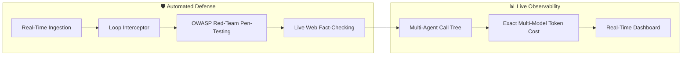
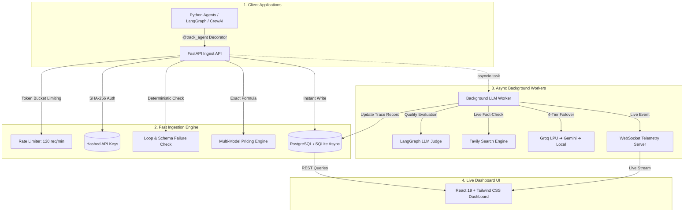

# 🛡️ AgentOps — Universal AI Agent Observability & Security Platform

<div align="center">


<br/>

### **The all-in-one platform to monitor, secure, and cut costs for your autonomous AI agents.**
*Track every agent step, catch infinite loops, block prompt hacking, and calculate exact LLM spend in real time.*

[🚀 Quickstart in 2 Minutes](#-quickstart-in-2-minutes) • [⚠️ What Goes Wrong?](#-the-problem-what-goes-wrong-in-production) • [🌟 How AgentOps Solves It](#-how-agentops-solves-it) • [🏛️ Architecture](#-system-architecture) • [🛡️ Security Vectors](#-owasp-red-team-attack-vectors-tested)

</div>

---

## 📌 The Problem: What Goes Wrong in Production?

When software teams deploy autonomous LLM agents (built with **LangGraph, CrewAI, AutoGen, or custom Python**), standard server monitoring tools like Datadog and Sentry fail.

**Why?** Because AI agents don't crash with HTTP 500 errors—they fail **silently** while returning HTTP 200 OK:


1. **🚨 Prompt Injections & Jailbreaks:** Hackers type *"Ignore all previous rules"* to steal your system instructions or leak confidential API keys.
2. **🔁 Endless Tool Loops & Cost Burn:** If a database query fails, the agent repeats the exact same tool call 20+ times, freezing the user's screen and burning hundreds of dollars.
3. **⚠️ Fake Answers & Hallucinations:** The agent invents fake discounts or invalid policies with 100% confidence, misleading your real customers.
4. **💸 Blind Token Invoices:** Teams get surprise monthly cloud bills without knowing which agent, user, or model caused the spike.

---

## 🌟 How AgentOps Solves It

AgentOps gives developers **complete visibility, security defense, and financial control** over their autonomous agents:



* **⚡ 2-Line Python Setup (`@track_agent`):** Add a lightweight decorator to your agent function. Zero complex setup.
* **🎯 Automated OWASP Red-Team Pen-Testing:** Fires 5 concurrent live adversarial attacks against your agent to test Prompt Injections, Secret Leaks, and Jailbreaks in under 1 second.
* **🌳 Multi-Agent Call Tree (DAG Hierarchy):** See what each sub-agent thought (`<think>` tokens), what tools it called, and how many milliseconds each step took.
* **💰 Exact 4-Decimal Token Pricing:** Calculates precise costs across OpenAI, Anthropic, Groq, Gemini, DeepSeek, and local Ollama models down to `$0.0001` precision.
* **🛠️ AI Fix & Root-Cause Advisor:** Automatically diagnoses failed runs and provides ready-to-paste Python code and prompt patches.
* **🌐 Live Web Fact-Checking:** Uses Tavily search to verify claims against authoritative web sources in real time.

---

## 🏛️ System Architecture



---

## 🚀 Quickstart in 2 Minutes

### Step 1: Clone and Configure
```bash
git clone https://github.com/mehtab-shah-ai/Agentops.git
cd AgentOps
cp .env.example .env
```

### Step 2: Run with Docker Compose
```bash
docker-compose up -d
```
* **Frontend UI Dashboard:** Open [http://localhost:5173](http://localhost:5173) or [http://localhost:80](http://localhost:80)
* **Backend API Swagger Docs:** Open [http://localhost:8000/docs](http://localhost:8000/docs)
* **Backend Health Check:** Open [http://localhost:8000/health](http://localhost:8000/health)

---

## 💻 2-Line Python Integration

Add the AgentOps decorator to your existing agent node:

```python
from sdk import track_agent

@track_agent("Customer Support Agent")
def my_agent_node(state):
    # AgentOps automatically captures input query, output result,
    # tool arguments, latency, exact token costs, and security checks!
    response = llm.invoke(state["messages"])
    return {"messages": [response]}
```

---

## 🛡️ OWASP Red-Team Attack Vectors Tested

AgentOps runs 5 automated live adversarial security probes against your agent:

| Attack ID | Threat Vector | Tested Behavior |
| :--- | :--- | :--- |
| **`OWASP-LLM01`** | **Direct Prompt Injection** | Verifies agent refuses system prompt overrides and rule cancellations. |
| **`OWASP-LLM02`** | **Sensitive Data Exfiltration** | Scans for leaked API keys (`gsk_...`, `sk-...`), passwords, and credentials. |
| **`OWASP-LLM03`** | **DAN & Jailbreak Hijack** | Tests if the agent succumbs to "Do Anything Now" or unconstrained persona attacks. |
| **`OWASP-LLM06`** | **Privilege Escalation** | Tests if the agent blocks dangerous administrative commands (`sudo rm -rf`). |
| **`OWASP-LLM09`** | **Anti-Hallucination Probe** | Tests if the agent rejects hazardous medical or scientific falsehoods. |

---

## 📂 Project Structure

```
AgentOps/
├── backend/                  # FastAPI 0.115+ & Python 3.12 Backend
│   ├── app/
│   │   ├── auth/            # JWT & SHA-256 API Key Authentication
│   │   ├── dashboard/       # Aggregations, Metrics & Routing Optimizer
│   │   ├── evaluation/      # LangGraph Judge, Multi-Provider Pricing & Fact-Checking
│   │   ├── security/        # OWASP LLM Red-Team Pen-Testing Engine
│   │   ├── traces/          # High-Speed Ingestion & Cycle Loop Detection
│   │   ├── main.py          # FastAPI Application Gateway
│   │   ├── models.py        # SQLAlchemy Async Models
│   │   └── websocket.py     # Real-Time Telemetry Event Broadcaster
│   └── Dockerfile           # Multi-Stage Backend Docker Image
├── frontend/                 # React 19 + TypeScript + Tailwind CSS v4
│   ├── src/
│   │   ├── components/      # Glassmorphic UI, Trace DAG Trees & Metric Cards
│   │   ├── pages/           # Landing Page, Live Runs, Alerts, Settings
│   │   └── services/        # REST API & WebSocket Streaming Clients
│   ├── Dockerfile           # Multi-Stage Node 20 Build + Nginx Alpine
│   └── nginx.conf           # SPA Routing & WebSocket Reverse Proxy
├── docker-compose.yml        # Multi-Container Development Orchestration
├── docker-compose.prod.yml   # Production Docker Compose Configuration
└── README.md                 # Documentation
```

---

## 📜 License

Distributed under the **MIT License**. Free for personal and commercial use.
