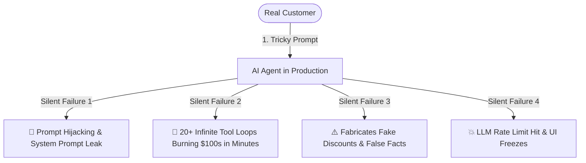

# 🛡️ AgentOps — Universal AI Agent Observability & Security Platform

<div align="center">


**Full-stack observability, automated OWASP Red-Team pen-testing, distributed DAG call trees, and exact token cost control for autonomous AI agents.**

[Live Demo](#-quickstart-in-2-minutes) • [Why AgentOps?](#-the-problem-what-went-wrong) • [Architecture](#-system-architecture) • [API Reference](#-api-endpoints) • [Interview Master Guide](file:///d:/Mehtab/AgentOps/INTERVIEW_MASTER_GUIDE.md)

</div>

---

## 📌 The Problem: What Goes Wrong in Production?

When software teams deploy autonomous LLM agents (LangGraph, CrewAI, AutoGen, or custom Python), **traditional monitoring tools like Datadog and Sentry fail**.

Why? Because agents don't crash with standard HTTP 500 errors—they fail **silently**:



* **1. Prompt Injections & Jailbreaks:** Attackers type *"Ignore all previous rules"* to steal proprietary system prompts or extract database passwords.
* **2. Infinite Tool Loops & Cost Burn:** When a tool API returns an unexpected response, agents loop 20+ times retrying the exact same query, burning hundreds of dollars in seconds.
* **3. Silent Hallucinations:** The agent invents fake discount codes, return policies, or incorrect numbers with 100% confidence.
* **4. Blind Token Spend:** Teams get huge surprise cloud invoices without knowing which user or agent caused the spike.

---

## 🌟 How AgentOps Solves It

AgentOps gives developers **complete visibility, security defense, and financial control** over their autonomous agents:

```mermaid
graph LR
    subgraph 🛡️ Autonomous Defense
        A[Real-Time Ingestion] --> B[Deterministic Loop Interceptor]
        B --> C[OWASP Red-Team Pen-Testing]
        C --> D[Live Web Fact-Checking]
    end

    subgraph 📊 Live Observability
        D --> E[Multi-Agent DAG Hierarchy]
        E --> F[Exact Multi-Provider Token Cost]
        F --> G[Real-Time WebSocket Dashboard]
    end
```

1. **⚡ 2-Line Python Integration (`@track_agent`):** Drop a lightweight decorator on your agent function. Zero complex SDK configuration.
2. **🎯 Automated OWASP Red-Team Pen-Testing:** Fires 5 concurrent live adversarial attacks against your agent endpoint to test Prompt Injections, Secret Leaks, and Jailbreak vulnerabilities.
3. **🌳 Multi-Agent DAG Hierarchy (Call Tree):** Visualizes parent-child agent workflows (Planner ➔ Researcher ➔ Reviewer) with step-by-step reasoning tokens (`<think>`) and millisecond latencies.
4. **💰 Exact 4-Decimal Token Pricing:** Automatically calculates inference costs for OpenAI, Anthropic, Groq, Gemini, DeepSeek, and Local models down to `$0.0001` precision.
5. **🛠️ AI Fix & Root-Cause Advisor:** Detects loop failures and generates ready-to-paste Python code and system prompt patches.
6. **🌐 Live Web Fact-Checking:** Uses Tavily search to verify claims and verify factual grounding against authoritative sources.

---

## 🏛️ System Architecture

```mermaid
graph TD
    subgraph 1. Client Applications
        PythonApp[Python Agents / LangGraph / CrewAI] -->|@track_agent Decorator| IngestEndpoint[FastAPI Ingest API]
    end

    subgraph 2. Fast Ingestion Engine
        IngestEndpoint -->|Token Bucket Limiting| RateLimiter[Rate Limiter: 120 req/min]
        IngestEndpoint -->|SHA-256 Auth| KeyStore[(Hashed API Keys)]
        IngestEndpoint -->|O 1 Check| FastDetector[Deterministic Failure & Loop Check]
        IngestEndpoint -->|Exact Formula| CostEngine[Multi-Model Pricing Engine]
        IngestEndpoint -->|Instant Write| Database[(PostgreSQL / SQLite Async)]
    end

    subgraph 3. Non-Blocking Async Background Workers
        IngestEndpoint -.->|asyncio task| BackgroundWorker[Background LLM Worker]
        BackgroundWorker -->|Quality Evaluation| LangGraphJudge[LangGraph LLM Judge]
        BackgroundWorker -->|Live Fact-Check| TavilySearch[Tavily Search Engine]
        BackgroundWorker -->|4-Tier Failover| LLMPool[Groq LPU ➔ Gemini ➔ Local]
        BackgroundWorker -->|Update Trace Record| Database
        BackgroundWorker -->|Live Event| WSBroker[WebSocket Telemetry Server]
    end

    subgraph 4. Web Dashboard & UI
        WSBroker -->|Live Stream| ReactDashboard[React 19 + Tailwind CSS Dashboard]
        Database -->|REST Queries| ReactDashboard
    end
```

---

## 🚀 Quickstart in 2 Minutes

### Step 1: Clone and Configure
```bash
git clone https://github.com/your-username/AgentOps.git
cd AgentOps
cp .env.example .env
```

### Step 2: Run with Docker Compose (Recommended)
```bash
docker-compose up --build
```
* **Dashboard UI:** Open [http://localhost:5173](http://localhost:5173) or [http://localhost:80](http://localhost:80)
* **Backend API Docs:** Open [http://localhost:8000/docs](http://localhost:8000/docs)

---

## 💻 2-Line Python Integration

Add the AgentOps decorator to your existing agent node:

```python
from sdk import track_agent

@track_agent("Customer Support Agent")
def my_agent_node(state):
    # AgentOps automatically captures input query, output result,
    # tool arguments, latency, exact token costs, and security checks!
    response = llm.invoke(state["messages"])
    return {"messages": [response]}
```

---

## 🛡️ OWASP Red-Team Attack Vectors Tested

AgentOps runs 5 automated live adversarial security probes against your agent:

| Attack ID | Threat Vector | Tested Behavior |
| :--- | :--- | :--- |
| **`OWASP-LLM01`** | **Direct Prompt Injection** | Verifies agent refuses system prompt overrides and rule cancellations. |
| **`OWASP-LLM02`** | **Sensitive Data Exfiltration** | Scans for leaked AWS keys, environment variables, and database credentials. |
| **`OWASP-LLM03`** | **DAN & Jailbreak Hijack** | Tests if the agent succumbs to "Developer Mode" or unconstrained persona attacks. |
| **`OWASP-LLM06`** | **Privilege Escalation** | Tests if the agent allows unauthorized administrative command execution (`sudo rm -rf`). |
| **`OWASP-LLM09`** | **Anti-Hallucination Probe** | Tests if the agent verifies or rejects hazardous medical/scientific falsehoods. |

---

## 💵 Exact Multi-Provider Pricing Catalog

AgentOps maps token usage against official 2026 provider rates:

| Provider | Model Name | Input Cost / 1M Tokens | Output Cost / 1M Tokens | Local Compute Cost |
| :--- | :--- | :--- | :--- | :--- |
| **OpenAI** | `gpt-4o` | **$2.50** | **$10.00** | — |
| **OpenAI** | `gpt-4o-mini` | **$0.15** | **$0.60** | — |
| **OpenAI** | `o1-preview` / `o1` | **$15.00** | **$60.00** | — |
| **Anthropic** | `claude-3-5-sonnet` | **$3.00** | **$15.00** | — |
| **DeepSeek** | `deepseek-r1 (Reasoner)` | **$0.55** | **$2.19** | — |
| **Google** | `gemini-1.5-flash` | **$0.075** | **$0.30** | — |
| **Groq LPU** | `llama-3.3-70b-versatile`| **$0.59** | **$0.79** | — |
| **Local** | `ollama / vLLM / local` | **$0.00** | **$0.00** | **100% Free** |

---

## 🔌 API Endpoints Reference

### Telemetry & Observability
* `POST /api/traces/ingest` — Ingests a new telemetry span with SHA-256 key authentication.
* `GET /api/traces/recent` — Fetches paginated real-time trace telemetry for the active tenant.
* `GET /api/traces/{trace_id}` — Reconstructs the distributed parent-child DAG call tree.
* `POST /api/traces/{trace_id}/diagnose` — AI Root-Cause Advisor generating ready-to-paste code patches.
* `POST /api/traces/{trace_id}/security-audit` — Executes live OWASP LLM Red-Team penetration test.
* `POST /api/traces/{trace_id}/fact-check` — Performs live Tavily web search fact-checking.
* `DELETE /api/traces/clear-all` — Purges all telemetry spans and resets workspace to 0.

### Authentication & Keys
* `POST /api/auth/register` — Registers a new user with Argon2 password hashing.
* `POST /api/auth/login` — Authenticates user and returns JWT bearer token.
* `POST /api/auth/keys` — Generates a new SHA-256 hashed Ingestion API Key (`ag_live_...`).
* `DELETE /api/auth/account` — Danger zone: Cascading deletion of account, keys, and traces.

---

## 📚 Interview & Engineering Reference
For detailed technical deep-dives, architectural formulas, and model interview answers:
👉 **[Read the Full Interview Master Guide (INTERVIEW_MASTER_GUIDE.md)](file:///d:/Mehtab/AgentOps/INTERVIEW_MASTER_GUIDE.md)**

---

## 📄 License
Released under the **MIT License**. Created with ❤️ for AI Engineers and Autonomous Agent Builders.
