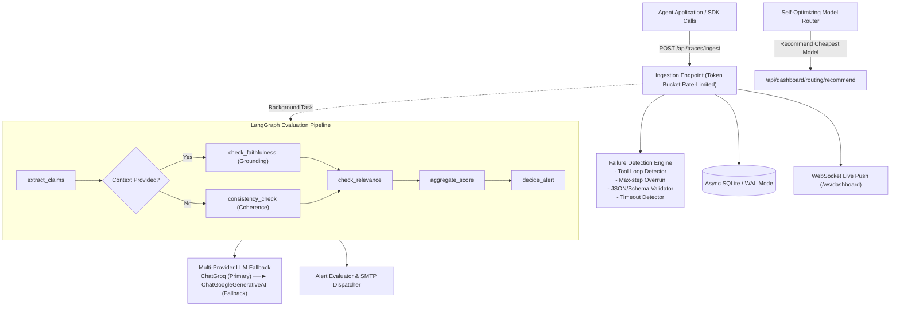

# AgentOps Backend

> **Production-grade AI-Agent Reliability, Quality Evaluation & Cost-Observability Platform**

AgentOps provides enterprise observability for AI agents and LLM pipelines (Sentry/Datadog for AI agents). Ingest traces from your agent workflows and monitor latency, costs, token usage, tool loops, validation failures, and LangGraph-powered hallucination evaluation scores into a unified observability platform.

---

## Key Architecture & Features



### 1. LangGraph StateGraph Evaluation Pipeline
- **Real LangGraph StateGraph**: Compiles typed `EvaluationState` with conditional branching.
- **Context Branch**: Validates extracted atomic claims against retrieved context documents.
- **No-Context Branch**: Evaluates internal consistency and logical coherence.
- **Multi-Provider Fallback**: Uses `ChatGroq` (`llama-3.3-70b-versatile`) as primary high-speed judge, seamlessly catching any API/rate-limit error and executing fallback on `ChatGoogleGenerativeAI` (`gemini-1.5-flash`).

### 2. Deterministic Rule-Based Failure Detection
- **Loop Detection**: Identifies repeated cycles of identical tool calls or alternating cyclic executions.
- **Max-Step Overruns**: Protects budgets against runaway agent loops.
- **Schema & Output Validation**: Detects malformed JSON or schema mismatches against `expected_schema`.
- **Timeouts & Exceptions**: Tracks network drops and uncaught exceptions.

### 3. Distributed Tracing & Call Tree Reconstruction
- Multi-step workflows (`router -> subagent -> tool_call`) grouped by root `trace_id` and nested by `parent_span_id`.
- Reconstruct full execution trees with latency and cost rollups via `GET /api/traces/{trace_id}`.

### 4. Self-Optimizing Model Router
- Tracks live quality, latency, and cost telemetry per `(model, task_type)`.
- Recommends the lowest-cost model meeting quality thresholds with automatic escalation if a model's quality dips.

### 5. Multi-Tenant SaaS Auth & Security
- User registration and login with JWT (`PyJWT` + bcrypt).
- Programmatic SDK API Keys (`ag_live_...`) with SHA-256 storage and tenant isolation.
- In-memory token bucket rate limiting on ingest endpoints.

---

## Folder Structure

```
agentops-backend/
├── app/
│   ├── __init__.py
│   ├── main.py                  # FastAPI app instance, CORS, WebSocket, routers
│   ├── config.py                 # Pydantic Settings, loads .env
│   ├── database.py               # Async SQLAlchemy connection setup & WAL mode
│   ├── models.py                 # User, ApiKey, Trace, Evaluation, Alert models
│   ├── schemas.py                # Pydantic request/response schemas
│   ├── websocket.py              # WebSocket connection manager for live dashboard push
│   ├── auth/
│   │   ├── __init__.py
│   │   ├── router.py             # /api/auth/register, /login, /me, /keys
│   │   ├── jwt_handler.py         # Passlib bcrypt & PyJWT token creation/verification
│   │   └── dependencies.py        # get_current_user, get_api_key_user dependencies
│   ├── traces/
│   │   ├── __init__.py
│   │   ├── router.py             # /api/traces/ingest, /recent, /{trace_id}
│   │   └── failure_detection.py   # Loop detection, max-step, schema validation logic
│   ├── evaluation/               # Flagship LangGraph module
│   │   ├── __init__.py
│   │   ├── graph.py              # LangGraph StateGraph definition
│   │   ├── nodes.py              # Processing nodes (extract, faithfulness, relevance)
│   │   ├── state.py              # EvaluationState TypedDict
│   │   └── llm_clients.py        # ChatGroq / ChatGoogleGenerativeAI + fallback wrapper
│   └── dashboard/                # Routing + Analytics + Alerting
│       ├── __init__.py
│       ├── router.py             # /api/dashboard/costs, /failures, /trends, /alerts
│       ├── routing_optimizer.py  # Self-optimizing routing & escalation engine
│       ├── alert_rules.py         # Threshold checking logic
│       └── alert_email.py         # Asynchronous SMTP email dispatcher
├── tests/
│   ├── conftest.py
│   ├── test_auth.py
│   ├── test_failure_detection.py
│   ├── test_evaluation_graph.py
│   ├── test_traces.py
│   └── test_dashboard.py
├── .env.example
├── requirements.txt
├── Dockerfile
└── README.md
```

---

## Getting Started

### 1. Environment Setup
```bash
cp .env.example .env
```
Fill in your `SECRET_KEY`, `GROQ_API_KEY`, and `GEMINI_API_KEY`.

### 2. Install Dependencies & Run
```bash
pip install -r requirements.txt
uvicorn app.main:app --reload --port 8000
```
API Documentation: [http://localhost:8000/docs](http://localhost:8000/docs)

### 3. Run Test Suite
```bash
pytest tests/ -v
```

### 4. Run with Docker
```bash
docker build -t agentops-backend .
docker run -p 8000:8000 --env-file .env agentops-backend
```
